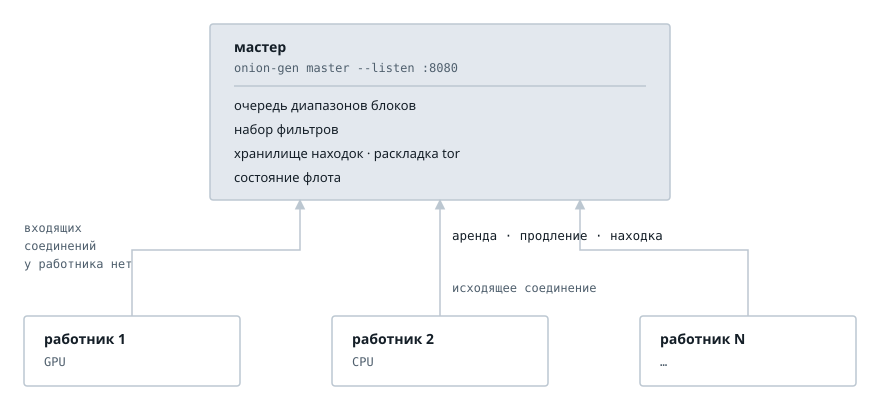
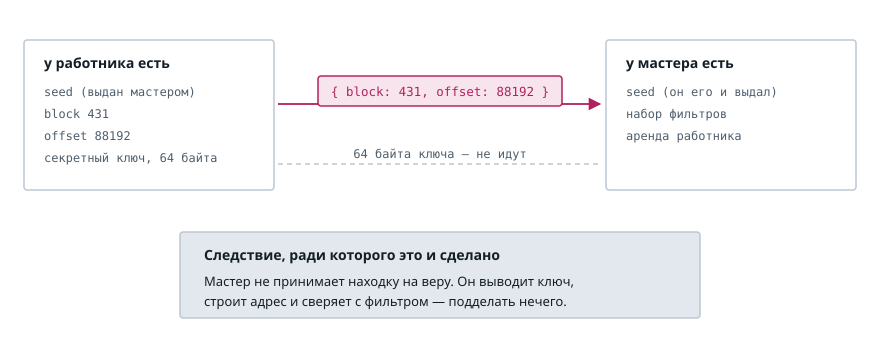
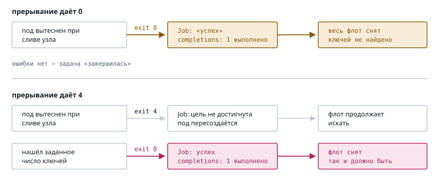

# Распределённый поиск: мастер и его работники

[English](distributed-search.md) | **Русский**

Этот документ описывает, как устроен распределённый поиск и почему именно так.

## 1. Зачем флоту нужно больше, чем много процессов

Поиск делится идеально. Кандидаты независимы, поэтому сто машин дают стократную
скорость. Флот должен добавить всё, что вокруг поиска.

Сто процессов без координатора — это сто отдельных прогонов. Находки исчезают
вместе с подом, и никто не скажет, какой процесс работает, а какой встал.

Поэтому флот обязан делать шесть вещей: регистрировать узел, раздавать
непересекающуюся работу, доставлять фильтры, собирать находки в одном месте,
сообщать статистику по каждому узлу и переживать потерю узла.

## 2. Расположение

Мастер держит очередь диапазонов, набор фильтров и хранилище находок. Работники
подключаются к нему сами.

Бинарник один, а роль выбирает подкоманда. У одиночного прогона подкоманды нет,
потому что именно так программой пользуются обычно:

```text
onion-gen -F test -d ./keys                       # одиночный прогон
onion-gen master --listen :8080 --store ./keys    # оркестратор
onion-gen worker --master http://master:8080      # работник
```

Работник принимает те же поисковые флаги, потому что ищет так же и отличается
только источником работы. У мастера свой набор флагов, и эти наборы не
пересекаются. В этом и довод за подкоманды: флаг, который что-то значит лишь
рядом с другим флагом, сообщает об ошибке позже и хуже, чем подкоманда, у
которой такого флага просто нет.

Фильтры программа спрашивает только у той роли, которой они нужны. Работник без
фильтров — не ошибка, потому что набор приходит от мастера.

Все роли несёт один образ. Образ на роль означал бы несколько артефактов со
своими версиями, а флот, собранный из разных коммитов, отказывает тишиной, а не
ошибкой: работники просто не получают работы.



Стрелки идут только вверх, и это свойство, а не выбор художника. **У работника
нет ни одного слушающего сокета.** Ему не нужны ни известный адрес, ни
сертификат, ни правило фаервола, и снаружи до него не дотянуться. Мастер не
знает, где его работники, и знать не должен.

## 3. Один цикл


Работник регистрируется, получает семя, диапазон блоков и набор фильтров. Затем
он ищет, продлевает аренду и сообщает о находках. Путь находки отмечен розовым,
и объясняет его раздел 4.

## 4. По проводу идут два числа



Работник сообщает, **где** он что-то нашёл, а не **что**. Семя раздал мастер,
значит, оно у него уже есть. Посылать то, что из семени выводится, незачем:
мастер выводит ключ сам, тем же `expanded_secret_at_offset`, которым
воспользовался бы работник.

Выигрыш не в трафике. Выигрыш в том, что **мастер может проверить находку**. Он
повторяет вычисление, строит адрес и сверяет его с фильтром. Сломанный или
подменённый работник не положит в хранилище то, чего не находил. Готовый ключ,
отправленный по проводу, пришлось бы принять на веру.

Находки мастер хранит в обычной раскладке tor: каталог на каждый адрес с теми же
тремя файлами, которые пишет одиночный прогон. Собрать их может любой
инструмент, и учить новый формат не нужно.

## 5. Когда узел исчезает

Оркестратор вытесняет под в любой момент. Это обычное событие, а не отказ, и
замысел обязан переживать его без вмешательства.


Поэтому мастер раздаёт аренды, а не назначения. Диапазон уходит на срок,
работник его продлевает, а истёкшая аренда возвращается в очередь. Диапазон,
назначенный навсегда, остался бы непройденным в тишине.

Цена реальна, и её стоит назвать. Часть диапазона, которую работник прошёл и о
которой не доложил, будет пройдена заново. Это секунды работы против гарантии,
что непройденное не теряется.

## 6. Аренда соразмерна работнику

Скорости по флоту различаются больше чем на порядок — от процессора до быстрого
устройства. Поэтому фиксированный размер аренды для кого-то неверен, какой его
ни назначь. Слишком маленький — и быстрое устройство тратит время на запросы
работы вместо работы, а пределом становится мастер. Слишком большой — и
вытесненный под означает, что в среднем половина диапазона будет пройдена
заново.

Работник сообщает свою скорость, и проверять её не нужно. Завышенная скорость
даёт диапазон, который работник не успеет пройти. Аренда истекает, диапазон
возвращается в очередь, и расплачивается тот, кто соврал. Остальных это не
касается.

Это стоит назвать, потому что здесь задача расходится с похожей на неё. В
майнинг-пуле майнеры шлют шары — частичные решения, доказывающие сделанную
работу. Шары существуют ради **расчётов**, а не ради проверки решения: вклад
нужно мерить честно, иначе завышенная скорость оплачивается чужими деньгами.
Здесь по заявленной скорости не распределяется ничего, значит и доказывать
нечего.

## 7. Когда исчезает мастер


Асимметрия очевидна. Мастер недоступен минуты, а находка, стоившая недели
поиска, второй раз не выпадет. Поэтому работник держит несданные находки на
диске и повторяет попытки.

Нового диапазона он при этом не берёт. Взять его самовольно — значит рисковать
пересечением с тем, кому мастер его уже отдал. Дорабатывать уже взятое
безопасно всегда.

Буфер не бесконечен. При переполнении система сообщает об этом и продолжает
хранить. Найденное она не отбрасывает ни при каких обстоятельствах.

## 8. Как оркестратор управляет работниками

Оркестратор не разговаривает с процессом. Он смотрит, **как процесс
завершился**. Поэтому управление — это коды выхода.



Ноль означает только то, что прогон достиг цели. Прогон, остановленный раньше,
выходит с 4 — сюда же относятся прерывание и прогон без цели. Ошибка в
командной строке даёт 2.

Причина видна на схеме. Если бы прерывание давало ноль, под, вытесненный при
сливе узла, читался бы как успех. Kubernetes счёл бы `completions: 1`
выполненным и снял бы весь флот, не найдя ни ключа. Ошибки не было бы нигде:
задача «завершилась», и искать никто не пойдёт.

**Один вопрос остаётся открытым.** Ненулевой выход при прерывании засчитывается
в `backoffLimit`. Приемлемо ли это или нужен ещё один код — проверяется на
настоящем кластере.

## 9. Управление по платформам

| Платформа | Запуск | Остановка по требованию |
|---|---|---|
| Kubernetes | `Deployment`, `replicas: N` | `kubectl scale --replicas 0` или удалить |
| Docker Swarm | `service`, `replicas: N` | `docker service rm` |
| Docker на ВМ | `compose up --scale` | `compose down` |
| Голая ВМ | systemd | `systemctl stop` |

Работники идут **репликами, а не задачей**. Столбца «останов по успеху» нет,
потому что реплика не завершается. Она работает, пока её не остановят, а решение
о том, что найдено достаточно, принимает человек, глядя в хранилище мастера.

Отсюда и пробы. Оркестратор спрашивает под, жив ли он и готов ли, и для
работника эти два ответа различаются. Liveness не зависит от связи с мастером,
иначе авария мастера перезапустила бы весь флот разом и выбросила бы каждый
текущий диапазон и каждую накопленную находку. Readiness от связи зависит, иначе
выкатка заменила бы весь флот подами, которым негде взять работу.

## 10. Чего этот замысел не делает

| Не делает | Почему |
|---|---|
| Реплицированный мастер | Его потеря останавливает раздачу и не теряет ни находок, ни сделанной работы. |
| Общефлотский `--limit` | Точный счёт стоил бы той самой координации, которой замысел избегает. Лишние ключи бесплатны. |
| Два режима работы | Работник одинаков в Kubernetes и на голой ВМ. Различается только способ узнать адрес мастера. |
| Шифрование находок | Мастер хранит ключи в обычной раскладке tor. |

## 11. Отвергнутые альтернативы

Есть ещё два подхода, и доводы против них лежат здесь, чтобы никто не выводил
их заново.

**Протокол консенсуса вроде Raft.** Он гарантировал бы, что два узла не держат
один диапазон. Цена — кворум минимум из трёх узлов, устойчивый состав, выборы
лидера при каждой пересборке пода, постоянное хранилище на узел и устойчивые
сетевые имена. В Kubernetes это `StatefulSet` с `PVC`.

Покупает эта цена защиту от события, стоящего секунд дублированной работы.
Индекс блока — это `u64`, а блок держит 64 пачки по 2048 кандидатов, поэтому
одно семя держит 2^81 кандидата. Самая быстрая доступная карта идёт по нему
около 80 миллионов лет. Аренды от мастера дают ту же непересекаемость без
кворума.

**Вовсе без координатора.** Каждый узел выводил бы своё пространство из общей
соли и собственной личности и ни с кем не разговаривал. Это работает и решает
одно требование из шести — раздачу работы. Находки остались бы на подах,
статистики не было бы, фильтры пришлось бы копировать руками, а две личности
могли бы молча совпасть.

**IP-адрес как личность** в такой схеме не годится. Адреса переиспользуются со
временем, меняются при перезапуске, не уникальны между частными сетями, и у
машины их несколько. С мастером вопрос исчезает: личность назначает он.
