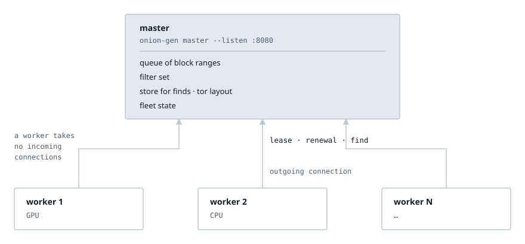
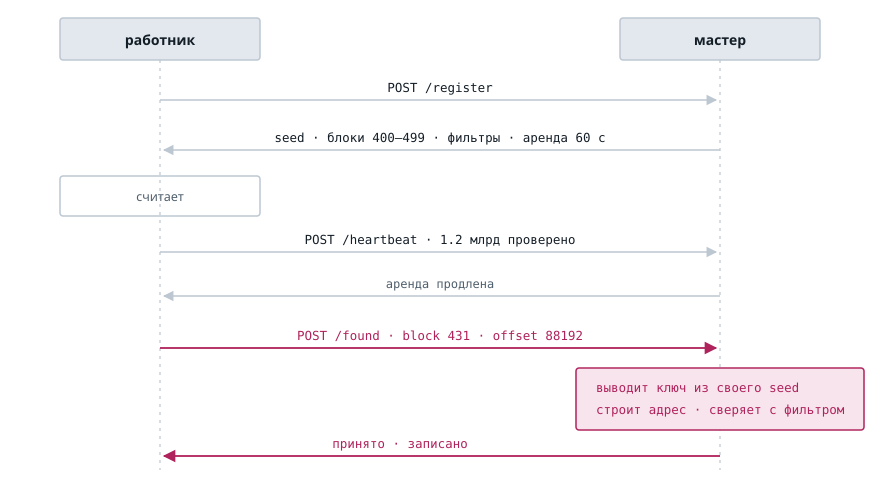
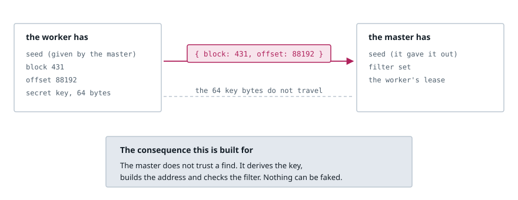
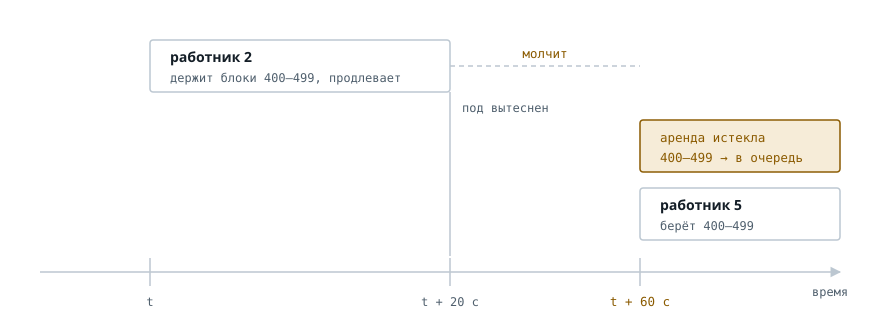
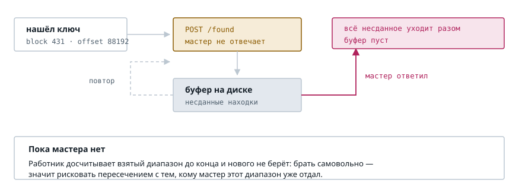
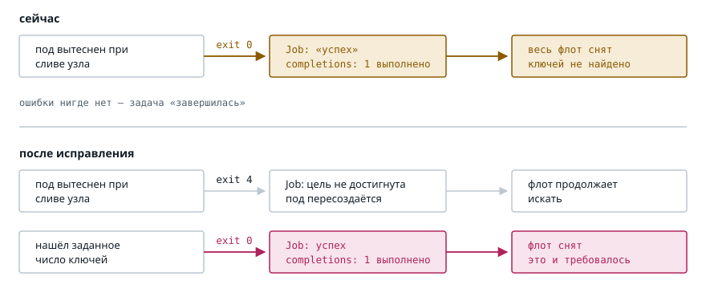

# Распределённый перебор: мастер и работники

[English](distributed-search.md) | **Русский**

Как устроен распределённый перебор и почему именно так.

## 1. Зачем

Перебор делится идеально: кандидаты независимы, и сто машин должны давать
стократную скорость. Но обвязки нет. Поднять сегодня сто подов означает сто
несогласованных прогонов, находки, исчезающие вместе с подом, и никакого
способа узнать, кто из ста работает, а кто встал.

Что должен уметь флот: регистрация узлов, раздача непересекающихся заданий,
доставка фильтров, сбор находок в одно место, поузловая статистика,
устойчивость к исчезновению узла.

## 2. Раскладка

Мастер держит очередь диапазонов, набор фильтров и хранилище находок.
Работники подключаются к нему сами.

Бинарник при этом один, а роль выбирается подкомандой — кроме одиночного
прогона, который подкоманды не получает, потому что он и есть обычное
употребление программы:

```
onion-gen -F test -d ./keys                       # одиночный прогон, как сейчас
onion-gen master --listen :8080 --store ./keys    # оркестратор
onion-gen worker --master http://master:8080      # работник
```

Флаги перебора у работника те же — перебирает он одинаково, различается только
источник заданий. У мастера свой набор, с остальными не пересекающийся, и это
довод за подкоманды: флаг, осмысленный только при другом флаге, сообщает об
ошибке позже и хуже, чем подкоманда, у которой чужого набора просто нет.

Фильтры при этом спрашиваются с того, кому они нужны: работник без них — не
ошибка, набор придёт от мастера.

Отдельный образ на роль означал бы несколько артефактов со своими версиями, а
флот, собранный из разных коммитов, ломается не ошибкой, а тишиной: работники
просто не получают заданий.



Стрелки направлены только вверх, и это не оформление, а свойство: **слушающих
сокетов у работника нет вообще**. Ему не нужен ни известный адрес, ни
сертификат, ни правило в межсетевом экране, и достать его снаружи нельзя.
Мастер не знает, где работники находятся, и обратиться к ним не может — ему
это и не нужно.

## 3. Один цикл



Работник регистрируется, получает семя, диапазон блоков и набор фильтров,
считает, продлевает аренду и сообщает о находках. Розовым выделен путь
находки — он устроен не так, как можно было бы ожидать.

## 4. По проводу идут два числа



Работник сообщает, **где** нашлось, а не **что**. Семена раздаёт мастер,
значит они у него уже есть, и пересылать выведенное из них незачем: мастер
выводит ключ сам тем же `expanded_secret_at_offset`, которым его вывел бы
работник.

Выигрыш не в трафике. Выигрыш в том, что **проверка становится возможной**:
мастер повторяет вычисление, строит адрес и сверяет его с фильтром. Работник,
неисправный или подменённый, не может положить в хранилище то, чего не
находил, — а при передаче готового ключа это пришлось бы принимать на веру.

Мастер хранит находки в обычной раскладке tor: каталог на адрес с тремя
файлами, теми же, что и при одиночном прогоне. Забрать их можно чем угодно, не
изучая нового формата.

## 5. Когда пропадает узел

Под вытесняется в любой момент. Это обычное событие, а не сбой, и устройство
должно его переживать без вмешательства.



Отсюда аренда, а не назначение: диапазон выдаётся на срок, работник его
продлевает, истёкшая аренда возвращается в очередь. Назначенный навсегда
диапазон остался бы непройденным молча.

Цена честная и её стоит назвать: та часть диапазона, которую работник успел
пройти и о которой не доложил, будет пройдена повторно. Это секунды работы
против гарантии, что непройденное не потеряется.

## 6. Размер аренды следует за работником

Разброс скоростей велик и измерен:

| Машина | Скорость | Блоков на 60 с аренды |
|---|---:|---:|
| RTX 4060, Vulkan | 960 млн/с | 439 774 |
| Apple M1 Pro, Metal | 150 млн/с | 68 527 |
| i9-9900K, процессор | 67 млн/с | 30 670 |

Разница между краями — 14.3 раза, так что фиксированный размер неверен для
кого-то всегда. Слишком малый заставляет карту тратить время на запросы вместо
счёта и превращает мастера в узкое место; слишком большой означает, что при
вытеснении пода заново проходится в среднем половина диапазона.

Скорость работник сообщает о себе сам, и проверять её не требуется. Завышенная
скорость даёт диапазон, который работник не успевает пройти: аренда истекает,
диапазон возвращается в очередь, и цена ложится на лгущего. Остальные не
страдают.

Это стоит отметить отдельно, потому что здесь проходит граница между нашей
задачей и внешне похожей на неё. В пуле для майнинга работник шлёт серверу не
только найденное решение, но и частичные — их называют ша́рами, от английского
share, «доля». Они заведомо встречаются чаще и потому негодны как результат,
зато годятся как свидетельство, что работа действительно велась. Нужны они не
для проверки решения, а для **выплат**:
вклад надо измерить честно, иначе завышенная скорость оплачивается чужими
деньгами. У нас по заявленной скорости ничего не распределяется, поэтому и
свидетельствовать нечего.

## 7. Когда пропадает мастер



Несимметричность цены очевидна: недоступность мастера длится минуты, а находка,
на которую ушла неделя перебора, второй раз не встретится. Поэтому работник
складывает несданное на диск и досылает.

Нового диапазона он при этом не берёт. Взять самовольно — значит рискнуть
пересечением с тем, кому мастер этот диапазон уже отдал; досчитать взятое
безопасно всегда.

Буфер не бесконечен. При переполнении система сообщает и продолжает хранить:
отбрасывать найденное она не станет ни при каких обстоятельствах.

## 8. Чем оркестратор управляет работниками

Оркестратор не разговаривает с процессом. Он смотрит, **чем тот закончился**.
То есть управление — это коды возврата, и здесь обнаружился дефект.

Проверено на живом бинарнике:

```
exit after SIGTERM, nothing found: 0
exit after finding what was asked: 0
```



Под, вытесненный при сливе узла, выходит с нулём. Kubernetes засчитывает успех,
`completions: 1` считается выполненным, и весь флот снимается, не найдя ни
одного ключа. Ошибки нигде нет: задача «завершилась», и разбираться никто не
пойдёт.

Нулём должен заканчиваться только прогон, достигший цели. К распределённому
режиму это отношения не имеет, но чинить надо здесь: без исправления
оркестратор не может управлять работниками ни при какой архитектуре.

**Открытый вопрос.** Если прерывание станет ненулевым, вытесненный под пойдёт в
счётчик `backoffLimit`. Приемлемо ли это или нужен ещё один код — проверяется
на живом кластере.

## 9. Управление по площадкам

| Площадка | Старт | Остановка по требованию |
|---|---|---|
| Kubernetes | `Deployment`, `replicas: N` | `kubectl scale --replicas 0` или удалить |
| Docker Swarm | `service`, `replicas: N` | `docker service rm` |
| Докер на ВМ | `compose up --scale` | `compose down` |
| Голая ВМ | systemd | `systemctl stop` |

Работники поднимаются **репликами, а не задачей**. Столбца «остановка по
достижении» поэтому нет: реплика не завершается, она работает, пока её не
остановят, и решение о том, что найдено достаточно, принимает человек, глядя на
хранилище мастера.

Отсюда же берутся пробы. Оркестратор всё время спрашивает у пода, жив ли он и
готов ли, и ответы на эти два вопроса у работника разные: живость не зависит от
достижимости мастера, иначе сбой мастера перезапустил бы разом весь флот и
выбросил бы и текущие диапазоны, и накопленные буферы. Готовность — зависит,
иначе выкатка заменила бы весь флот подами, которым негде взять работу.

## 10. Чего в этой схеме нет

| Чего нет | Почему |
|---|---|
| Реплики мастера | Его падение останавливает раздачу, но не теряет ни находок, ни проделанной работы. Решать до появления жалобы — значит гадать. |
| Общего `--limit` на флот | Точный счёт стоил бы согласования. Лишние ключи бесплатны. |
| Двух режимов работы | Работник один и тот же в Kubernetes и на голой виртуалке. Различается только то, откуда он узнаёт адрес мастера. |
| Шифрования находок | Не запрашивалось. Мастер хранит ключи в обычной раскладке tor. |

## 11. Отвергнутые варианты

Прежде чем остановиться на мастере, рассматривались два других подхода, и
причины отказа стоит записать, чтобы не возвращаться к ним заново.

**Протокол согласования (Raft).** Дал бы гарантию, что два узла не получили
один диапазон. Цена — кворум минимум из трёх узлов, устойчивое членство,
выборы лидера при каждой пересборке пода, постоянное хранилище на узел и
стабильные сетевые имена, то есть `StatefulSet` с `PVC`. Покупалась бы на это
защита от события, которое стоит секунд дублированной работы: индекс блока —
`u64`, в блоке 64 пакета по 2048 кандидатов, то есть одно семя вмещает 2^81
кандидатов, и самая быстрая доступная карта идёт по нему 80 миллионов лет.
Аренды у мастера дают ту же непересекаемость без кворума.

**Схема без координатора вовсе.** Узел выводил бы своё пространство из общей
соли и собственной личности и ни с кем не разговаривал. Работает, но решает
только раздачу работы — один пункт из шести. Находки остались бы на подах,
статистики не было бы, фильтры пришлось бы копировать руками, а личности
могли бы молча совпасть.

**IP-адрес в роли личности** (в той схеме) не годится: переиспользуется во
времени, меняется при перезапуске, не уникален между частными сетями, и
адресов у машины несколько. При мастере вопрос отпадает — личность выдаёт он.
